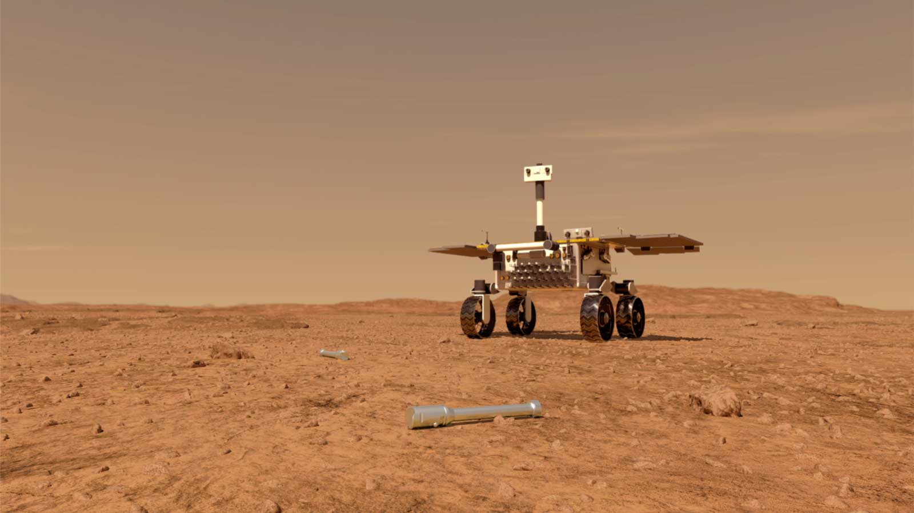

# MarsCamBot: Rover martien intelligent  

Construis un rover martien avec une carte Raspberry Pi et programme-le avec des techniques  d'intelligence artificielle de reconnaissance d'images pour aller rechercher de précieux tubes sur Mars en 2026!

<h4>Le rover martien Fetch en 2026 à la recherche des tubes laissés sur mars en 2022 par le rover Perseverance - <a href="https://mars.nasa.gov/resources/24761/fetch-rover-approaching-sample-tubes-artists-concept/">Vue d'artiste</a>:</h4>
 

**! En cours de construction !**

## Public ciblé

* A partir de **10 ans** pour les activités de construction du robot, reconnaissance d'images, et **programmation en Scratch**
* A partir de **14 ans** pour les activités de construction du robot, reconnaissance d'images, et **programmation en Python**

## Aperçu et motivations des activités

En 2026, l'Agence Spatiale Européenne (ESA) et la National Aeronautics and Space Administration (NASA) enverront [un rover sur Mars avec pour mission de récuperer des tubes contenant des échantillons de sol martien](https://fr.wikipedia.org/wiki/Mars_Sample_Return#Mission_Sample_Retrieval_Lander_(SRL)). Le rover, qui s'appelle Fetch (qui signifie 'récupérer' en anglais), devra être capable de se déplacer, de retrouver les tubes, et de les récupérer de la façon la plus autonome possible. Pour cela, Fetch utilisera des techniques d'intelligence artificielle, notamment de reconnaissance d'images pour trouver de façon autonome les tubes déposés sur le sol par le rover [Perseverance](https://en.wikipedia.org/wiki/Perseverance_(rover)) en 2022. 

Les activités proposées ici visent à faire découvrir comment concevoir un système d'intelligence artificielle pour de la reconnaissance d'images, et comment permettre à un rover martien de l'utiliser. 

Les activités se décomposent en trois parties:

* Tout d'abord, nous expliquons comment créer **un modèle prédictif pour la reconnaissance d'image**. On utilisera pour cela la *Google Teachable Machine*. On montrera ensuite comment le modèle peut être **utilisé dans un programme de façon simple, avec Scratch, ou en Python** pour retrouver des tubes sur un sol martien. Ce sont les activités 1 à 3 ci-dessous.

<h4>Google teachable Machine: Apprends à une IA à reconnaître des images:</h4>
 

* La deuxième partie consistera à **construire un rover**, et à programmer des déplacements. Une carte programmable [Raspberry Pi](https://www.raspberrypi.com/products/raspberry-pi-3-model-b/) et le [CamJam EduKit](https://camjam.me/?page_id=1035) seront utilisés (Le CamJam EduKit fournit toutes les pièces nécessaires à la construction du rover: Les roues, les moteurs, et la connectique). L'activité est prévue pour être **simple, relativement abordable financièrement** (Environ 80 euros en tout pour un CamJam EduKit, une carte programmable Raspberry Pi, et une caméra), et offrant une **large liberté dans la 'personnalisation' de l'apparence du rover**.  Ce sont les activités 4 à 7 ci-dessous.

<h4>Exemples de rovers CamJam EduKit construits avec un chassis en carton, en impression 3D, ou en bois:</h4>

<table>
    <tr>
        <td> 
             
        </td>
        <td> 
             
        </td>
        <td> 
            
        </td>
    </tr>
    <tr>
        <td> 
            

            <a href="https://www.youtube.com/watch?v=LJDEV7rGwaM">Chassis en carton (avec la boîte du CamJam EduKit)</a>
            

        </td>
        <td> 
            

            <a href="https://camjam.me/?page_id=1035">Chassis en impression 3D</a>
            

        </td>
        <td> 
            

            <a href="https://www.youtube.com/watch?v=LKTpj8QHWEc">Chassis en bois</a>
            

        </td>
    </tr>
    
</table>

* La troisième partie consistera à **utiliser le modèle de reconnaissance d'image sur le rover**, pour permettre à celui-ci de retrouver de façon autonome des tubes dans son environnement. Nous proposons un sol martien à imprimer, de façon à rendre l'activité proche de ce qu'un rover martien pourra voir une fois à destination! Ce sont les activités 8 et 9 ci-dessous.

### Détail des activités

* De 10 à 14 ans: Programmation des activités avec Scratch

Numéro activité | Activité | Dépend des activités | Temps estimé
 :--- | :--- | :--- | :--- 
1 | Reconnaissance d'images avec Google Teachable Machine | | 2-4h
2 | Reconnaissance d'images avec Scratch (Adacraft) | 1  | 2-4h
4 | Jeu - Centre de contrôle Fetch | (1) | 2-4h
5 | Construction d'un rover avec Raspberry Pi | | 2-4h
6 | Contrôle du rover avec un site Web | 5 | 1h
7 | Contrôle du rover avec Scratch (Adacraft) | 5 | 2-4h
9 | Contrôle du rover et reconnaissance d'images avec Scratch (Adacraft) | 1, 5, 7 | 2-4h

* De 14 à 18 ans: Programmation des activités avec Python 

Numéro activité | Activité | Dépend des activités | Temps estimé
 :--- | :--- | :--- | :---
1 | Reconnaissance d'images avec Google Teachable Machine | | 2-4h
3 | Reconnaissance d'images en Python | 1  | 2-4h
4 | Jeu - Centre de contrôle Fetch | (1) | 2-4h
5 | Construction d'un rover avec Raspberry Pi |  | 2-4h
6 | Contrôle du rover avec un site Web | 5  | 1h
8 | Contrôle du rover avec Python | 5 | 2-4h
10 | Contrôle du rover et reconnaissance d'images avec Python | 3, 5, 8 | 2-4h

## Objectifs pédagogiques 

Les activités permettent d'appréhender et s'approprier les notions d'algorithmes, de logigrammes, et les concepts de bases 

* de la programmation (conditions, boucles, variables, objets)
* de robotique (construction d'un rover, câblage d'une carte programmable avec des moteurs et une batterie)
* de l'intelligence artificielle (entrainer un modèle de prédiction avec des exemples, utiliser le modèle dans un programme).

### Référentiel FMTTN

Création de contenus

* Savoir: Programmation et logigrammes.
* Savoir-Faire: Lire un algorithme simple, Écrire un algorithme simple, Lire un programme simple, Écrire un programme simple, Identifier des éléments relatifs à la programmation et aux logigrammes.
* Compétences: Concevoir un algorithme pour résoudre un problème simple, Concevoir un programme pour résoudre un problème, Porter un regard critique sur les raisons d’être et les conséquences induites par un algorithme.

### Référentiel MIT AI Ethics

[Un programme d'études sur l'éthique de l'intelligence artificielle pour les élèves de collège](https://docs.google.com/document/d/1pQ8D4iDnwKoiveJOZZgy6SLvgDD1nYQOPFUwyuBpEic/edit#) (Page 7)

* 1 - Comprendre les mécanismes de base des systèmes d'intelligence artificielle. 
* 1.a. Connaître trois parties d'un algorithme : entrée, étapes pour changer l'entrée, sortie. 
* 1.b. Savoir que l'intelligence artificielle est un type d'algorithme spécifique et comporte trois parties spécifiques : ensemble de données, algorithme d'apprentissage et prédiction. 
* 1.c Comprendre le problème de la classification dans le contexte de l'apprentissage automatique supervisé. Comprendre comment la quantité de données d'entraînement affecte la précision et la robustesse d'un modèle d'apprentissage automatique supervisé. 
* 2.c. Connaître le terme « biais algorithmique » dans le contexte de la classification.
	* Comprendre l'effet des données d'entraînement sur la précision d'un système d'apprentissage automatique.
	* Reconnaître que les humains ont le pouvoir de conserver des ensembles de données de formation.
	* Comprendre comment la composition des données d'entraînement affecte “le résultat”  d'un système d'apprentissage automatique supervisé.
* 4.b. Identifier les ensembles de données nécessaires pour former un système d'IA pour atteindre cet objectif.
 

